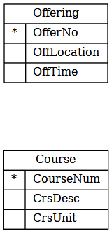
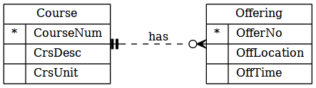

# Database Lecture 2 - 23 Jan 2015

## Review

- Database is a collection of data
- DBMS is a software that manage database
- To use DBMS you need to perform data modeling to format data according to the database technology
  - Ex. Store Facebook users and their friends
    - If using file there is no fixed format for storing relationship. You might use two files and pointers to link them or use user identifier to link them.

## Entity Relationship Model

- Not a data model -- only tell how data is represented and not how to access them
- Use for conceptual design
  - Help you get a clear picture of data for communicating with stakeholders
- Independent of database technology (relation, object oriented, etc.)
- A graphical way to represent this is an ER diagram.

To keep track of students we examine attributes of students such as hair color, height, ID, phone numbers. Then we model it as an entity "student". The entity "student" has attributes like ID number, name, study year, address, hair color, height.

When we want to keep track of other group of people there might be a different set of attributes.

So in summary,

- Entity is a collection of things of interest
  - eg. person, places, things, events
- Entity contains attributes with name

Example of entity diagram:

(The underlined part are primary key, more on that later)

Another example:

**Student** <- entity type

ID | FirstName | LastName | GPA
---|-----------|----------|------
561054...| A | A | 3.0
561054...| B | B | 3.3

The table header are attributes and the rows are instances of student

### Entity

- Must have attribute to describe entity
- Must have identifier (each instances can be distinguished)

### Attribute

- Describe entity's characteistics
- Primary key is a special attribute
  - Unique value (no duplicate)
  - Identify a particular instance in the entity type
  - Sometime we use composite key which make multiple attributes a key (eg. FirstName+LastName)
  - Sometimes we use non-unique primary key

### Relationship

- Association between entity instances
- Has relationship name (should be active verb)
- Unary relationship - relationship between entity of same type
  - Facebook users can be friend of other users
- Binary relationship - relationship between entity of 2 different types
  - eg. Student owns a locker
  - Has several types:
    - One to one: a student owns a locker, a locker may only be used by one student
    - One to many: a department has many students. a course has many course offerings.
    - Many to one: reverse look at one to many
    - Many to many: a student enrolls in offerings. an offering can be enrolled by multiple students. a book can be borrowed by many members. a member can also borrow many books.
- Ternary - relationship between entity of 3 different types
  - eg. Instructors, TAs and course offerings
  - TA is stored seperately from instructor as TA does not belongs to instructor but to a course offering. A TA may also teach several course offerings
- Relationship is bidirectional and may have direction. For example,
  - In course's perspective: a course has many offerings. 
  - Offering's perspective: an offering is being provided for a course.

#### Example

ID  | Name
----|-------
101 | Database
102 | OS
103 | Network

OfferNo | Semester | Year
--------|----------|-------
1       | 1        | 2014
2       | 1        | 2015
3       | 2        | 2015

1. Each course has many offerings
2. An offering has an associated course

### Cardinality

- Specify min/max amount of relationship
- 0..n = no upper bound
- Mandatory - min >= 1
- Optional - min = 0

### Relationship in ER Diagram

- `|` represents 1
- `o` (blacked) represents 0
- `<` (crow's foot with 3 claw) represents many (N)
- One side of the relationship line has two symbols. For example, 1:1 is `||` and `1:n` is `|<`

### Weak and strong entity

- Weak entity - cannot exists without relationship
  - A room is inside a building. If there is no building there cannot be a room.
  - Primary key of weak entity is borrowed from other entity types.
  - It may have local key

In this picture the line is solid line and the `RoomNo` is not a primary key but a local key. The weak entity is drawn by rounded corner

### Storing many to many

Relationships are stored as the primary key. In 3 way relationship between `Project`, `Part` and `Supplier` a new entity is used:

**Uses**

Project | Part | Supplier
--------|------|----------
Pancake | Egg | 7-11
Pancake | Milk | Lotus
Pancake | Flour | 7-11

(suppose the names are primary keys)

The uses entity type is associative entity type which track 3 way relationship.

## Generalization

- Another form, higher form of relationship
- eg. Employee is divided to several subtypes such as officer, teller, secretary