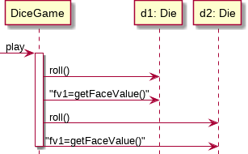
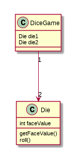
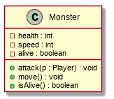
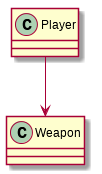
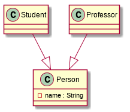
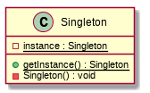

# SoftSpec Lecture 1 - 15 Jan 2015

Instructor: kee@fameworks.co

## Analysis vs. Design

Analysis is to look at the patterns emerging from the problems. Design is to find solutions to the problem.

OOA/D stands for Object-Oriented analysis: finding objects emerging from problems. We use object as human understand objects easier.

## Dice game

- Player rolls two dice
- Sum = 7, win
- Sum != 7, lose

If using waterfall model:

1. Define use cases - sequence of steps/stories on what will happen throughout the software lifecycle
2. Define domain model
3. Define interaction diagram - how things happen/interact in sequence
4. Define class diagram
5. Write codes
6. Write tests

### Use cases

Use case: Play a dice game

1. A player requests to roll two dice
2. The system presents the results
3. If the sum is 7, player wins otherwise loses.

### Domain model

- Can be expressed as a diagram

**A player** requests to roll two **dice**. **System** presents results. If the sum of faces is 7, player wins, otherwise player loses.

Here we have "Player" "Die" "Game".


(A player rolls two dice. A player plays a game. A game has two dice.)

**The domain model are not software objects**, but they could be similar.

### Interaction diagram



### Class diagram



See that player is missing from this class diagram as we doesn't care about the player.

Both of the interaction diagram and class diagram are important. Class diagram shows what is in a class and the interaction diagram shows how it works.

### Coding

DiceGame.java

```java
public class DiceGame {
	private Die die1 = new Die();
	private Die die2 = new Die();

	public void play() {
		// this method is explained in the sequence diagram
		die1.roll();
		int fv1 = die1.getFaceValue();
		die2.roll();
		int fv2 = die2.getFaceValue();
		int sum = fv1 + fv2;

		if(sum == 7){
			System.out.println("The sum is 7, you win.");
		}else{
			System.out.println("The sum is " + sum + ", you lose.");
		}
	}

	public static void main(String[] args){
		DiceGame game = new DiceGame();
		game.play();
	}
}
```

Die.java

```java
import java.util.Random;

public class Die {
	private int faceValue;

	public void roll() {
		Random random = new Random();
		// random 1-6
		faceValue = 1 + random.nextInt(6);
	}

	public int getFaceValue() {
		return faceValue;
	}
}
```

After writing the codes we move everything to the `game` package and create `test` package then write some test units using JUnit 4.

test/DieTest.java

```java
package test;

/**
 * Some tests of the Die class.
 */

public class DieTest {
	@BeforeClass
	public static void setUpBeforeClass() throws Exception {
		// something to do each time this test is run
		// but do it only once
	}

	@Test
	public void testRoll(){
		Die die = new Die();
		die.roll();
		int value = die.getFaceValue();
		assertTrue(value > 0 && value <= 6);
		// test that the value is consistent
		assertEquals("shouldn't change", value, die.getFaceValue());
	}
}
```

## Processes

### Waterfall process

- The process goes down and rarely goes up
- Borrowed from construction industries
- Most of the requirements are defined at the beginning

The waterfall:

- Requirements - what users want?
- Design
- Implementation
- Verification
- Maintenance

The problem with waterfall process:

- Users usually doesn't know what they want. They will know it only when they have tested it
- But.. that is when it is too late to go back
- Usually requirements would change 25-50% from the starting requirement.

When to use waterfall?

- If the requirement is clear and fixed
- You have enough expertise

### Iterative and Evolutionary Development

- Split project into workable small projects (iteration)
- At the end of each iterations the project will grows
- In each iteration the work process is similar to waterfall

Pros

- Less project failures - the mistake will only happen in that iteration and not throughout
- Early visible progress so early feedback
- Reduce complexity

### Agile

Agile focus on interaction between companies and users. Working apps over documentation. Embrace changes.

### Unified Process

UP is a framework which seperate into 4 phases

- Inception - Define use cases, scope. Very short period
- Elaboration - Divided into iterations. Most of the requirements and the core parts are done. Some more use cases and diagrams will appear.
- Construction - Divided into iterations. This is the phase where the software and most of coding are done
- Transition - Move from development to production. Testing, etc.

In each phases there could be iteration or waterfall process inside. (This is how UP is a "framework", you adjust the exact behaviours yourself)

## Class diagram



The `-` sign is for private while `+` is for public. If something is underlined it is static.

There will be association between classes.



A player "use" the weapon. (The weapon doesn't know about the player)

**Aggregation:**


Professor has class.

**Composition:**


Square *always* belong to chessboard. Square is meaningless without chessboard.

**Generalization:**



Person is the base class of both Student and professor

**Realization:**


## Design Patterns

Language dependent way to solve common programming problems

### Singleton

Singleton is a pattern that ensure only have one instance in the entire program.

```java
public class Foo {

	private static Foo instance;

	public static Foo getInstance(){
		// lazy initialization
		if(instance == null){
			instance = new Foo();
		}
		return instance;
	}

	private Foo(){
		// prevent creation of Foo outside of this class
	}

	public static void main(String[] args){
		Foo foo = Foo.getInstance();
		Foo foo2 = Foo.getInstance();
		System.out.println(foo1 == foo2);
	}
}
```

Singleton is used in `Runtime` class in Java. You cannot do `new Runtime();` but `Runtime.getRuntime();`.

The diagram of Singleton



### Decorator Pattern

Decorator pattern solves the problem of adding new behavior to object without affecting other objects from the same class.

```java
public abstract class Coffee {
	public abstract double getPrice();
	public abstract String getIngredients();
	public String toString() {
		return "Cost: " + getPrice() + " Ingredients: " + getIngredients();
	}
}

class BaseCoffee extends Coffee {
	@Override
	public double getPrice() {
		return 60;
	}
	@Override
	public String getIngredients(){
		return "[Water] [Coffee]";
	}
}
abstract class CoffeeDecorator extends Coffee {
	private Coffee coffee;

	// this is the signature of decorator.
	// a constructor that accept base class and save it
	// as an attribute
	public CoffeeDecorator(Coffee coffee) {
		this.coffee = coffee;
	}

	@Override
	public double getPrice() {
		return coffee.getPrice();
	}

	public String getIngredients() {
		return coffee.getIngredients();
	}
}

class MilkedCoffee extends CoffeeDecorator {
	public MilkedCoffee(Coffee coffe){
		super(coffee);
	}
	public double getPrice(){
		return coffee.getPrice() + 10;
	}
	public String getIngredients() {
		return coffee.getIngredients() + " [Milk]";
	}
}

class WhippedCoffee extends CoffeeDecorator {
	public WhippedCoffee(Coffee coffe){
		super(coffee);
	}
	public double getPrice(){
		return coffee.getPrice() + 15;
	}
	public String getIngredients() {
		return coffee.getIngredients() + " [Whipcream";
	}
}

class Main {
	public static void main(String[] args){
		Coffee coffee = new BaseCoffee();
		System.out.println(coffee);
		MilkedCoffee milked = new MilkedCoffee(coffee);
		System.out.println(milked);
		MilkedCoffee doubleMilked = new MilkedCoffee(milked);
		System.out.println(doubleMilked);
	}
}
```

Next time quiz from book page 1-60