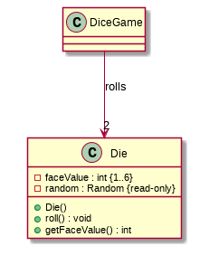
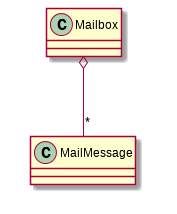
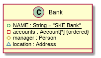
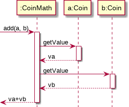
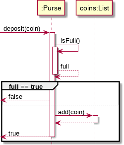

# Softspec lab 2 - 22 Jan 2015

## Class Diagram

Class diagram shows the structure of the system and can be used for

- Modeling: Identifying key objects and their relationship
- Software design
- Implementation level diagram



At modeling, we only have `faceValue` then in software design we realize that `faceValue` is int {1..6} and it has `roll` behavior. For implementation level design we adds the constructor and `getFaceValue`. After you have write it you might realize that you need `random`, a random number generator instance.

Note that we don't write the `dice1`, `dice2` attributes in `DiceGame` as it is shown already as an association ("rolls")

### Example

```java
public class LineItem extends AbstractItem implements Comparable<LineItem> {
	private Product product;
	public int getDayOfMonth() {
		Date today = new Date();
		int day = today.getDate();
		return day;
	}
}
```


Arrowheads in UML:


### Example 2

Aggregates are things that collect other things

```java
public class MailMessage {
	private Address sender;
	private Calendar date;
	private String subject;
	private String body;
}

public class Mailbox {
	private List<MailMessage> messages;
	public Mailbox() {
		messages = new LinkedList<MailMessages>();
	}
	// ...
}

```



- * is written instead of a number and means any amount
- if we write 0..32767 instead of * it means that it can contains any amount of MailMessage up to 32767

### Example 3

```java
/**
 * a square on a game board
 */
public class Square {
	private String color;
	private Piece piece; // piece on this square, maybe null
}
/**
 * a game board for chess
 */
public class ChessBoard {
	private final Square[] squares = new Square[64];
	public ChessBoard() {
		for(int k = 0; k < 64; k++){
			square[k] = new Square();
			square[k].setColor((k%2==0) ? Color.BLACK : Color.WHITE)
		}
	}
}
```

In this case `ChessBoard` owns `Square`. `Square` only appears in one collection and if we destroy the collection it will destroy the individual objects too. This is called "Composition".


### Example 4

```java
public class Bank {
	public static final String NAME = "SKE Bank";
	private List<Account> accounts; 
	private static Bank instance;
	protected Person manager;
	Address location;

	public static Bank getInstance() {
		
	}
}
```



Or we can write stuff as association


## Sequence diagram


If the `Coin` type is written as `:Coin` we say that it is some sort of `Coin` object (can be any Coin) but if it is written as `C:Coin` it IS the `Coin` class.

We can even write just `:` to indicate that we doesn't care about type of object at all.

In the design phase we can write informal name like "an Order" and also informat method names

### Example

```java
public class CoinMath {
	public double add(Coin a, Coin b){
		double va = a.getValue();
		double vb = b.getValue();
		return va+vb;
	}
}
```



```java
public class Purse {
	private int capacity = 10;
	private List<Coin> coins;
	/** deposit money into the purse */
	public boolean deposit(Coin coin){
		if(isFull()){
			return false;
		}
		coins.add(coin);
		return true;
	}

	/** return true if purse is full */
	public boolean isFull() {
		if(coins.size() == capacity){
			return true;
		}else{
			return false;
		}
	}
}
```

