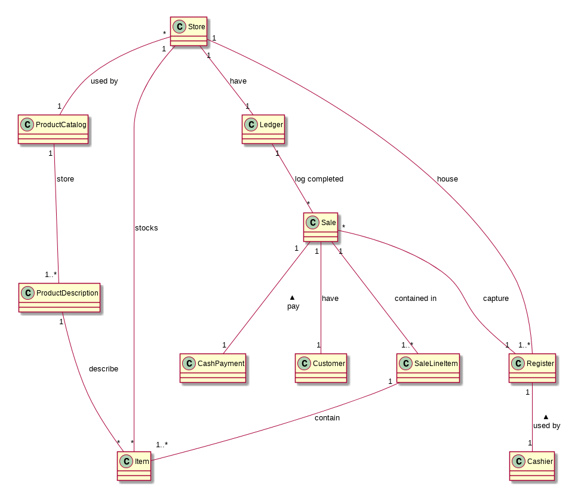

# Softspec lecture 4 - 12 February 2015

(Note: stuff in slide may not be noted here)

## Use case & Re-engineering

Many companies has legacy code. Maybe the documentation is not good and the maintainer left.

To work with them, we might have to redevelop them or re-engineer it.

To re-engineer contains two phases

- Reverse engineer: look at working application and see models out of it
  1. Look at the code quality
    - How much we should re-engineer it? (maybe the code can't be be run any more)
    - Worst case: use the knowledge from it to start from the group up
  2. Build the abstract model (Mostly in inception, elaboration phase of UP) because the code could be quite large
    - One way to do this: interview users
    - But the users doesn't know how exactly the code works
    - Then we get use cases
  3. Analysis the implementation model
    - Look at packages, folders, files, etc.
  4. Run the use cases
    - Record the method calls ("traces")
    - Trace is not complete! It depends on input and environment (eg. if method branches depending on output of `Math.random()`)
  5. Map function to the implementation model
    - Now we should have an idea where to start your work
- Forward engineer: think about future development

## User story

- Originated from Extreme Programming
- Tell you what users want
- More lightweight than use cases
  - Use case is sequential
  - User story CANNOT be changed
- Short (1-2 sentences)
- Self contained
- Answer who/what/why

Cons:

- User story can't scale very well
  - We have to keep track every of them and there're a lot of them
  - Compared to use case it contains multiple user stories into one flow
- Doesn't contain non functional requirements

Examples:

- As a *something*, I want *something* so that *something*
  - As a cashier, I want to see a list of products customer is purchasing so that I can tell the customer how much they have to pay
- Maybe omit the benefit?
  - As a cashier, I want to see a list of products customer is purchasing
- Or even emphasize it
  - To tell the customer how much they have to pay, as a cashier I want to see a list of products customer is purchasing

## Elaboration

- Implement simple, key version of the application
- Don't implement all requirements at once
- Mostly focus at 1 use case in each iteration (but could be more)

### Domain model

- We write domain model because it help you see relationship between objects and business people would understand application better
- Number, text, boolean should be attribute in domain model
- But something bigger like "Airport" (that has its name, code, etc) should be class.

### Sale

