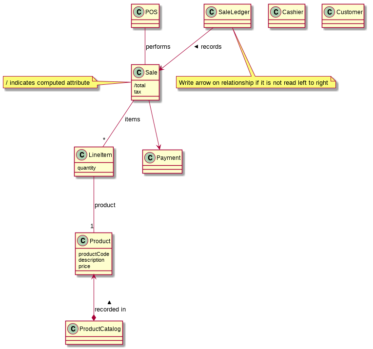

# Softspec lab 5 - 19 February 2015

## Quiz answer

## Milestone

Milestone is to let the customers and managers understand what's going on in the project.

To do that, we need a plan which creates work products (and failed work products).

### Major milestone
- Show real progress which establish a new baseline
  - eg. Login, framework selected is not a progress to the completed product
- Should be at least 1 per iteration
- Milestone should be done or not done. Not 90% done

Example:

- Inception phase
  - Vision and scope are reviewed
  - Worthiness is evaluated
- Elaboration 1
  - UC1 is designed, implemented, tested, demonstrated.
  - Domain model written, documented, verified against requirements and committed to repository.

## Get out of inception

Have these artifacts

- Vision, mockup
- Business case (risk assessment)
- Glossary
- Initial requirements
  - Software requirement specifications
  - Use cases
  - Supplementary Specifications (non-functional requirements)
- High level candidate architectures
  - eg. chosen platform and framework
- Prototype
  - can be working or non working just to verify vision of functional requirements