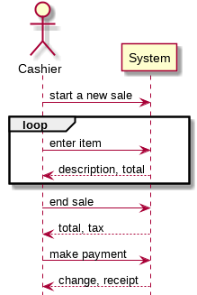
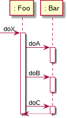
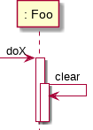
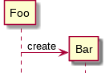
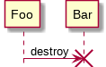
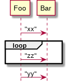
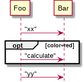
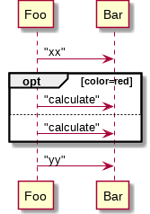
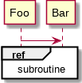

# Softspec Lecture 5 - 19 February 2015

## System Sequence Diagram (SSD)

- SSD shows a single sequence of use case
- Show the sequence of interaction between model objects
- Objects and interactions should be named at the abstract level (goal, intend not UI)
- No activation boxes

### Use case

1. Customer arrives at POS with items
2. Cashier starts at a new sale
3. Cashier enters item id
4. System records sale line item and present item description, price and total
- Cashier repeats step 3-4 until done
5. System present total with taxes calculated
6. Cashier tells customer the total and ask for payment
7. Customer pay and system handle payment

## Operational Contract

- Precondition, postcondition
- Write postcondition in past tense
  - A `SaleLineItem` was created
  - **NO** Create a `SaleLineItem`
  - **no** A `SaleLineItem` is created

### Example

**Contract CO2: enterItem**

- **Operation**: enterItem(itemID : ItemID, quantity : Integer)
- **Cross References**: Use Cases: Process Sale
- **Preconditions**: There is a sale underway *(what should happen before this operation)*
- **Postconditions**:
  - A `SaleLineItem` `sli` instance was created
  - `sli` was associated with the current `Sale`
  - `sli.quantity` became quantity

## Sequence diagram

- How objects interact with messages

### Notation

#### Message

#### self call

#### creation

#### termination

#### loop

#### condition

#### reference

## Communication diagram

- Same as interaction diagram but more compact
- PlantUML can't draw it so no picture in this lecture note :(

## Class diagram

- Static object modelling
- Don't put both relationship and attribute of the same thing.
  - If attribute is a data type it should be put as attribute
  - If attribute is another object it should be put in another related class
- Some association are excluded in the domain model (eg. sale doesn't know register, but register know the sale it's being created)
- Use [1..*] after the attribute for collection attribute (or use a relationship line)
- Use dotted line to indicate dependency (a class cannot exists without its dependencies)
- Can add user-defined sections (eg. exception thrown, responsibilities)