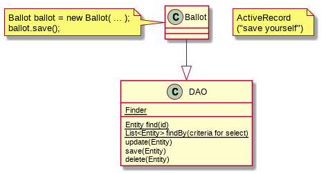

# Softspec Lab 6 - 26 February 2015

## Reuse

Software is built for reuse: reuse code, reuse the design patterns, reuse algorithms (shortest path algorithm, etc), reuse idioms (for loop, etc).

### Log

To log in Java we can use the [Log4j](https://logging.apache.org/log4j/2.x/) library. It provides several methods to log messages and sort the messages such as the output format, where to log it.

The good part of logging with Log4j is that we can specify minimum log level (eg. warning or more severe only, no debug).

Play framework use [Logback](http://logback.qos.ch/) as its logging library which is similar to Log4j.

### Application

Some frameworks has example project that we can modify to our need. [AppFuse](http://appfuse.org/) is also a good source of well written applications.

## Design pattern

We have a situation that occurs over and over. We have a motivation (what we're going to achieve and the constraints) to solve it. The solution we designed to solve this situation is reusable. This is elements of design pattern.

### Example

- Pattern name: Iterator
- Context: We need to access the elements of a collection
- Motivation: We want to access elements of a collection without knowing the structure of it
- Solution: Each collection provides a iterator with method to get the next item. The caller doesn't need to know how it is done.
- Consequence: Application is not constrained to the internals of the data structure and the structure can be easily changed.

To implement iterator, we have the iterator interface and each collection data structure implements a concrete implementation of the iterator. The caller calls the iterator using the interface, not the concrete type.

### Singleton pattern

See lecture 1.

The bad part of singleton is it could be a hazard if it is lazy initialized in a threaded application.

### Observer pattern

A *subject* is a source of events. Other objects called *observers* wish to know when an event occurs.

The subject will provide a method for observers to register themselves as interested. When an event occurs, the subject will call a method on the observers.

### Strategy pattern

A class requires some behavior. There are many ways it could be implemented.

The class will implement that behavior in seperate class called *strategy* and it implements an interface.

## Software fact of life

The common source of fail for software project are

1. Change
2. Complexity
3. Bugs

### Principle for good design

- Gang of four principle
  - Class should has one reason to change (class should have only one set of responsibility)
  - Prefer association over inheritance
  - Program to interface, not implementation
  - Seperate what varies from what stay the same
  - Depend on abstraction. Don't depend on concretions.
- Robert Martin's SOLID principle
  - Single Responsibility Principle - A class should have only one responsibility
  - Open and close principle - A class should be open for extension but not modification. (Design the software that you can add parts to it without editing other classes)
  - Liskov Substitution principle
  - Interface Segregation principle
  - Dependency Inversion

## Persistent

In Play the ActiveRecord is implemented but the methods are in the `Model.Finder` class.