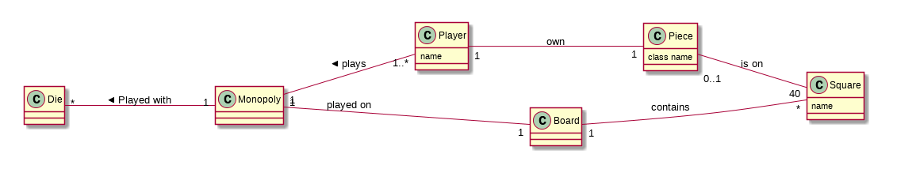
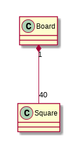
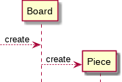
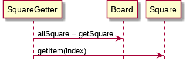
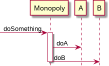

# Softspec lecture 6 - 26 February 2015

## Object responsibility
- Not a method
- With great responsibility comes great method counts

### Doing
- Doing by itself
- Doing by create other objects
- Coordinating other objects

### Knowing
- Know about its data
- Know about its related object

## GRAPS

- A design pattern

### Monopoly example

#### Creator pattern

- Who create the square here?

The answer is board

(Use a black diamond because a square cannot live without board)

- Who are responsible to find square given its number (key)

The answer is also board as square is part of board

#### Information Expert

- Assign responsibility to class that has information about it

#### Low coupling

- To reduce impact of change, assign responsibility so that unnecessary coupling remains low

In the UML of above section if board manages square and square changes, the board has to change. We create another class to manage the squares instead.

#### Controller pattern

- Controller knows about everything and coordinate stuff. Controller handle the UI.

In the example, Monopoly is the controller who manages other objects.

#### Cohesion of the system

The first diagram is an example of *bloated controller*. The second example delegates the work to other classes.