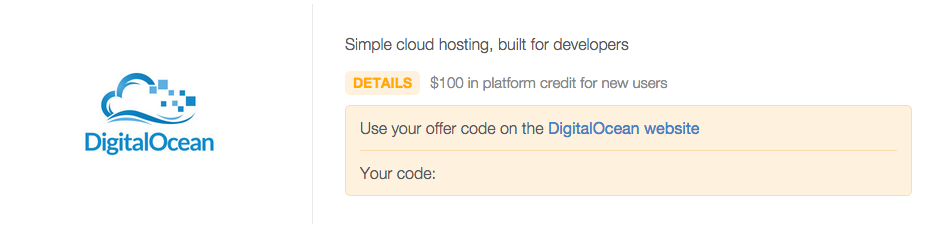
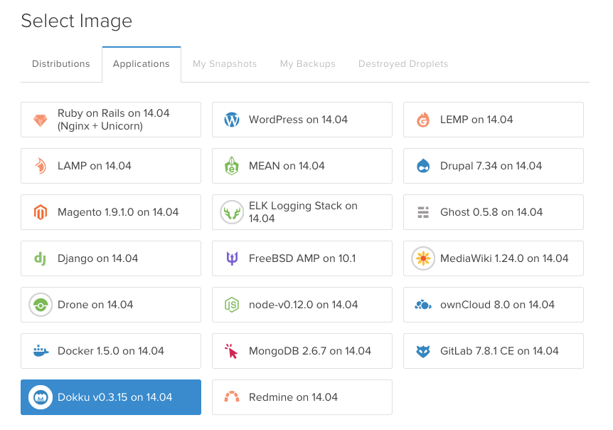
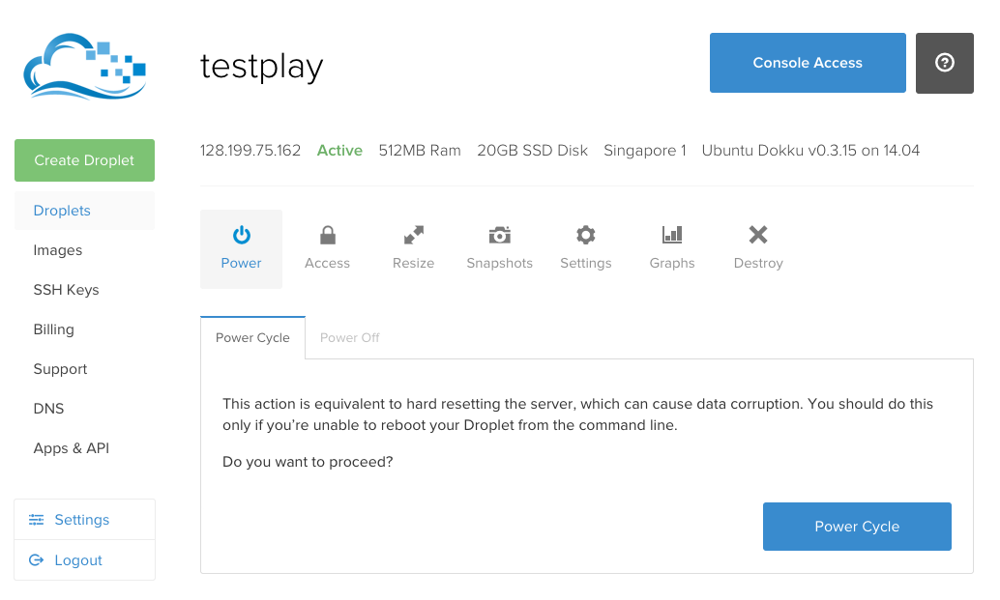
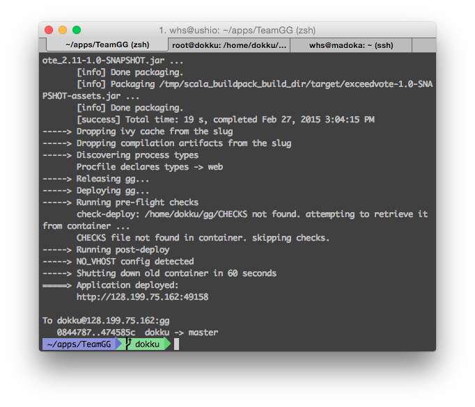

# ติดตั้ง Play framework บน DigitalOcean

## ขอ account

สามารถขอเครดิตฟรี $100 จาก GitHub ได้ที่ [GitHub for Education](https://education.github.com/discount_requests/new) โดยใช้เมล ku.ac.th (ไม่ใช่ ku.th)



ให้เอารหัสที่ได้ไปใส่ที่ [Promo](https://cloud.digitalocean.com/user_payment_profiles) ถ้าจะสมัครใหม่อย่าลืมใช้ [Referral code เรา](https://www.digitalocean.com/?refcode=4aeb73ddac2e) :p

## Add public key

*(ขั้นตอนการใช้ ssh-keygen ไม่ต้องทำ ถ้าเคยสร้าง ssh key ใน GitHub/Bitbucket ไปแล้ว)*

ให้ Generate ssh public key ขึ้นมา โดยสั่ง

```sh
ssh-keygen -t rsa -b 4096
```

แล้วคัดลอกข้อความในไฟล์ `~/.ssh/id_rsa.pub` (ใช้ nano หรือ subl เปิดก็ได้)

สำหรับ Windows ให้ลง Git แล้วเปิด Git Bash ขึ้นมารันคำสั่งเมื่อกี้ได้เลย ไฟล์จะอยู่ที่ `C:\Users\username\.ssh\id_rsa.pub` ใช้ notepad เปิดได้

----

*(ขั้นตอนนี้ต้องทำ)*

เข้าไปที่หน้า [SSH Keys](https://cloud.digitalocean.com/ssh_keys) กด Add SSH Key แล้ว Paste ข้อความลงไปในช่อง Public SSH Key ตั้งชื่อตามต้องการ

## Dokku

การติดตั้ง Play จะมี 2 วิธีด้วยกันคือลงด้วยระบบเปล่าๆ กับใช้ Dokku โดย Dokku เป็นโปรแกรมจำลองระบบให้เหมือนกับ Heroku ข้อดีของวิธีนี้คือไม่จำเป็นต้องเซต server ทั้งหมดเอง

**ข้อความรู้** แอพที่จะติดตั้งด้วย dokku ตัวโปรแกรมต้องอยู่ภายนอกสุดของ git เท่านั้น พูดง่ายๆ คือ เปิดเข้าไปใน GitHub ของ project เราแล้วจะต้องเห็นไฟล์ชื่อ build.sbt เลย

#### Framework อื่นๆ ด้วย Dokku

ถ้าจะหาวิธีติดตั้ง Framework อื่นๆ ให้ลองศึกษาดูว่าเซตลง Heroku ทำยังไง ก็ทำตามแบบเดียวกันได้หมดเลย ยกเว้นเวลา push ให้ push ไปที่ server เราแทน แล้วก็ตัว database เราอาจจะใช้ MySQL/MariaDB​ โดยติดตั้งตาม guide นี้ก็ได้ หรือจะลง Postgres แล้วติดตั้งตาาม guide ของ Heroku ก็ได้

(เท่าที่พอรู้คร่าวๆ Postgres ดีกว่า MySQL แต่เซตยุ่งยากเลยไม่ค่อยนิยม)

### Create VM

เข้าไปที่ [DigitalOcean Control Panel](https://cloud.digitalocean.com) กดที่ Create Droplet ซ้ายมือ กรอกรายละเอียดตามต้องการ

- Hostname อะไรก็ได้ แนะนำเป็นชื่อเว็บที่จะลงจริง เช่น gg.whs.in.th หรือถ้าไม่มีเว็บใส่เป็นชื่อเฉยๆ เช่น madoka ก็ได้
- Size เท่าไรก็ว่าไปเพราะแรมมันไม่พออยู่ดี 555
- Region ใช้ Singapore จะเข้าเร็วสุด
- Settings ไม่จำเป็นต้องเปิดอะไรเลย
- Image เลือก Application > Dokku ตามภาพ



- SSH Key เลือกเป็น Public Key ที่ใส่ไว้เมื่อกี้

เมื่อ create จะใช้เวลาประมาณ 1-2 นาทีแล้วจะมีอีเมลมาเตือนด้วย ก็ให้คลิกเข้าไปที่เครื่องในหน้า Droplet แล้วจด IP ไว้



### อัพแรม

ขั้นตอนต่อมา เนื่องจาก Play Framework กินแรมตอนคอมไพล์เยอะมากเลยจะต้องทำ swap file ก่อน (Windows เรียกว่า page file)

ให้เปิด Terminal/Git Bash มาแล้วสั่ง

```sh
ssh root@ip
```

(เปลี่ยน ip เป็นไอพีตามที่จดไว้ ถ้ามีคำถาม The authenticity ... ให้ตอบ `yes`)

เสร็จแล้วสร้าง swap file ขึ้นมาขนาด 1GB

```sh
dd if=/dev/zero of=swap bs=1M count=1024 # create a 1024*1MB empty file named swap
mkswap swap # format the file named swap as swap
chmod 600 swap
swapon swap # enable swap at the file named swap
echo "/root/swap    none    swap    sw    0   0" >> /etc/fstab
free -m
```

จะเห็นว่าในคำสั่ง `free -m` จะแสดงว่าเรามี swap เท่าไรซึ่งจะต้องมากกว่า 0 แสดงว่า Swap ได้ทำงานแล้ว

เสร็จแล้วเราจะกลับมาใช้ ssh อีกเยอะ อย่าเพิ่งปิดหน้าต่าง

### Setup Dokku

ให้เปิด browser เข้าไปที่ IP ของเครื่อง จะพบหน้าต่างตามภาพ


- ถ้ามีโดเมนให้กรอกโดเมนลงไปในช่อง hostname  และติ๊ก Use virtualhost naming for apps
- ถ้าไม่มีโดเมน ให้กรอกเลข IP ลงไปในช่อง hostname
- จะเห็นว่าช่อง admin ssh key จะกรอกไว้แล้วเป็นค่า public key ของเราที่เซฟเอาไว้ ไม่ต้องแก้อะไร

### Setup database

ขั้นต่อมาเราจะติดตั้ง Database server บน Server ให้กลับไปที่ ssh ที่เราเปิดค้างไว้ตอนอัพแรม แล้วสั่ง

```sh
cd /var/lib/dokku/plugins
git clone --recursive https://github.com/Kloadut/dokku-md-plugin mariadb
cd mariadb/dockerfiles
git checkout master
dokku plugins-install
```

คำสั่งหลังสุดจะรันนานมากเพราะมันจะติดตั้ง Ubuntu 14.04 อีกตัวและติดตั้ง MariaDB ลงไป

แล้วสร้าง database ใหม่

```sh
dokku mariadb:create projectname
```

(ตรง projectname ให้ใส่เป็นชื่อ URL ที่จะเข้าในกรณีที่เปิด virtualhost naming ไว้ เช่น ถ้ากรอก hostname ไปว่า `gg.whs.in.th` ก็จะเข้าแอพได้ที่ `projectname.gg.whs.in.th`)

---

ให้ติดตั้ง plugin สำหรับต่อ MySQL บน Play โดยเปิด `build.sbt` มาแก้ไข `libraryDependencies`

```
libraryDependencies ++= Seq(
  javaJdbc,
  javaEbean,
  cache,
  javaWs,
  "org.mariadb.jdbc" % "mariadb-java-client" % "1.1.8"
)
```

(ดูตัวอย่างใน [TeamGG](https://github.com/SSD2015/TeamGG/blob/master/build.sbt) ได้)

และสร้างไฟล์ `Procfile` (P ใหญ่) ไว้นอกสุดของ git เขียนว่า

```yaml
web: target/universal/stage/bin/myapp -Dhttp.port=${PORT} -DapplyEvolutions.default=true -Ddb.default.driver=org.mariadb.jdbc.Driver -Ddb.default.url=jdbc:mysql://172.17.42.1:49153/db\?user=root\&password=5PE7DYsaevADJadb
```

- แก้คำว่า myapp ให้เป็นชื่อโปรแกรมของเราตามที่เขียนไว้ใน build.sbt (เช่น `name := """exceedvote"""` ก็ใส่ว่า `target/universal/stage/bin/exceedvote`) อันนี้ไม่ใช่ projectname ที่กำหนดในขั้นตอนเมื่อกี้ ให้ยึดตาม build.sbt อย่างเดียว
- แก้ตรง url โดยใส่ข้อมูล mysql ตามที่โปรแกรมให้มาตอนสั่ง create ในรูปแบบ `jdbc:mysql://IP:PORT/database\?user=root\&password=password`
  - ปกติแล้ว Dokku จะสร้าง URL ตรงนี้ให้ แต่ต้องมานั่งเขียนเองเพราะ URL ที่ให้มานั้น Play ไม่รองรับ

Commit การแก้ไขทั้งหมดลง git

```sh
git add Procfile
git commit -a -m "Added Procfile"
```

### Install

ให้เปิด terminal/Git Bash ไปที่ folder ของ project เราแล้วสั่ง

```sh
git remote add dokku dokku@ip:projectname
```

(อย่าลืมเปลี่ยน ip กับ projectname ให้ถูกต้อง​)

จากนั้นทุกครั้งที่ต้องการอัพเดตแอพ ให้สั่ง

```sh
git push dokku master
```

ตัว Dokku จะคอมไพล์แอพของเราให้และติดตั้งให้พร้อมใช้งาน (ขั้นตอนนี้จะใช้เวลานานมากในครั้งแรกเพราะโปรแกรมจะโหลด Play Framework มาติดตั้งให้) เมื่อเสร็จแล้วจะขึ้น URL ให้มา (ถ้าลงแบบ IP ตัว port อาจจะเปลี่ยนไปเรื่อยๆ)



ถ้า deploy สำเร็จแล้วแอพไม่ขึ้นอาจจะมีปัญหาเรื่องการเซต database ลองดู log ดู

### Maintenance

ลงเสร็จแล้วอาจจะมีกระบวนการบางอย่างที่อยากจะทำ เช่น

#### ดู log

ในกรณีที่แอพมีปัญหาใช้งานไม่ได้ ลองเปิด log ดูอาจจะรู้สาเหตุได้ โดย ssh เข้าไปแล้วสั่ง

```sh
dokku logs projectname
```

## ติดตั้งมือ

วิธีการติดตั้งมือนั้นจะซับซ้อนน้อยกว่าการใช้ Dokku และยืดหยุ่นกว่า แต่ก็มีขั้นตอนเยอะอยู่เหมือนกัน

### Create VM

เข้าไปที่ [DigitalOcean Control Panel](https://cloud.digitalocean.com) กดที่ Create Droplet ซ้ายมือ กรอกรายละเอียดตามต้องการ

- Hostname อะไรก็ได้ แนะนำเป็นชื่อเว็บที่จะลงจริง เช่น gg.whs.in.th หรือถ้าไม่มีเว็บใส่เป็นชื่อเฉยๆ เช่น madoka ก็ได้
- Size เท่าไรก็ว่าไป
- Region ใช้ Singapore จะเข้าเร็วสุด
- Settings ไม่จำเป็นต้องเปิดอะไรเลย
- Image สำหรับ Guide นี้ใช้ CentOS 7
  - CentOS 7 มี [systemd](https://speakerdeck.com/whs/systemd-linux-init) ซึ่ง Ubuntu, Debian จะปรับมาใช้ในอนาคต
- SSH Key เลือกเป็น Public Key ที่ใส่ไว้ในขั้นตอนข้างบน หรือจะไม่ใช้ก็ได้โดยจะมีอีเมลบอกรหัสอีกที

เมื่อ create จะใช้เวลาประมาณ 1-2 นาทีแล้วจะมีอีเมลมาเตือนด้วย ก็ให้คลิกเข้าไปที่เครื่องในหน้า Droplet แล้วจด IP ไว้


### Install MySQL driver

ระหว่างรอสร้างเครื่อง กลับมาที่เครื่องของเรา ให้ติดตั้ง plugin สำหรับต่อ MySQL บน Play โดยเปิด `build.sbt` มาแก้ไข `libraryDependencies`

```
libraryDependencies ++= Seq(
  javaJdbc,
  javaEbean,
  cache,
  javaWs,
  "org.mariadb.jdbc" % "mariadb-java-client" % "1.1.8"
)
```

(ดูตัวอย่างใน [TeamGG](https://github.com/SSD2015/TeamGG/blob/master/build.sbt) ได้)

### Compile app

ต่อมาให้แพคแอพเป็นไฟล์ โดยสั่ง

```sh
activator universal:packageZipTarball
```

(สั่งใน folder ของ project เหมือนกับเวลาสั่ง `activator run`)

จะได้ไฟล์ `target/universal/appname-1.0-SNAPSHOT.tgz` (appname จะเป็นชื่อแอพตาม build.sbt) ให้อัพโหลดขึ้นบน server

```sh
scp target/universal/appname-1.0-SNAPSHOT.tgz root@ip:
```

(ไม่แน่ใจถ้าใช้ Windows มี `scp` ให้ใน Git Bash มั้ย ถ้าไม่มีก็ใช้ FileZilla อัพขึ้นไปก็ได้ โดยตั้ง username=root, port=22​ อัพโหลดไปไว้ที่ /root)

### อัพแรม

เช่นเดียวกันกับการใช้ Dokku เราจะต้องเพิ่มแรมให้เครื่องเราไม่งั้นจะไม่พอใช้

```sh
dd if=/dev/zero of=swap bs=1M count=1024 # create a 1024*1MB empty file named swap
mkswap swap # format the file named swap as swap
chmod 600 swap
swapon swap # enable swap at the file named swap
echo "/root/swap    none    swap    sw    0   0" >> /etc/fstab
```

### Install Java & MySQL

ถัดไปจะติดตั้งโปรแกรมที่จำเป็นต้องใช้บน server

```sh
wget --no-cookies --header "Cookie: oraclelicense=accept-securebackup-cookie" http://download.oracle.com/otn-pub/java/jdk/8u31-b13/jdk-8u31-linux-x64.rpm # Download jdk8
rpm -Uvh jdk-8u31-linux-x64.rpm
yum install -y mariadb-server # Install mariadb
systemctl enable mariadb # start mariadb on boot
systemctl start mariadb # start mariadb right now
mysql_secure_installation
```

(ที่ต้องโหลด JDK8 เองเพราะ CentOS ยังไม่มี JDK8 ให้)

เมื่อสั่ง `mysql_secure_installation` จะมีเมนูคำถามให้ตอบดังนี้

1. **Enter current password for root (enter for none):** กด enter
2. **Set root password? [Y/n]** ตอบ `y`
3. **New password:** ตั้งรหัส admin database (จะไม่ขึ้นอะไรเลยเวลาพิมพ์)
4. **Remove anonymous users? [Y/n]** ตอบ `y`
5. **Disallow root login remotely? [Y/n]** ตอบ `y`
6. **Remove test database and access to it? [Y/n] y** ตอบ `y`
7. **Reload privilege tables now? [Y/n] y** ตอบ `y`

ต่อมาจะสร้าง database และ user ของแอพเรา ให้สั่ง `mysql -p` แล้วกรอกรหัส admin database ลงไป

```sql
CREATE DATABASE app;
GRANT ALL ON app.* TO app@localhost IDENTIFIED BY 'password';
```

ตั้งรหัสผ่านได้ตามใจชอบ (user `app` จะสามารถทำอะไรใน database `app` ก็ได้ ยกเว้นสร้าง user หรือ database ใหม่)

### Create user

เพื่อความปลอดภัยเราควรจะรันแอพเราด้วย user ปกติ ไม่ใช่ root

```sh
useradd app
```

### Install app

ย้ายไฟล์ที่อัพโหลดขึ้นมาไปไว้ที่ของ user app แล้วแตกไฟล์

```sh
mv appname-1.0-SNAPSHOT.tgz ~app
cd ~app
tar xf appname-1.0-SNAPSHOT.tgz
chown -R app:root appname-1.0-SNAPSHOT
```

### Setup systemd

ขั้นต่อมาเราจะให้ระบบ start แอพเราให้โดยอัตโนมัติ โดยให้แก้ไขไฟล์ `/etc/systemd/system/app.service` (จะใช้ vi หรือ nano ตามสะดวก) ใส่ตามนี้

```ini
[Unit]
After=network.target
[Service]
User=app
Group=app
WorkingDirectory=/home/app
StandardError=journal
ExecStart=/home/app/appname-1.0-SNAPSHOT/bin/appname -DapplyEvolutions.default=true -Ddb.default.driver=org.mariadb.jdbc.Driver -Ddb.default.url=jdbc:mysql://localhost/app?user=app&password=app
[Install]
WantedBy=multi-user.target
```

(อย่าลืมเปลี่ยน `appname` 2 จุด และ password ของ database อันที่สร้างทีหลัง)

เสร็จแล้วสั่ง

```sh
chmod 600 /etc/systemd/system/app.service
systemctl daemon-reload
systemctl enable app # start app on boot
systemctl start app # start app now
```

ถึงตรงนี้น่าจะเข้า `http://ip:9000/` ได้แล้ว ถ้าไม่ได้ลองดู log

```sh
systemctl status app -l
```

### Setup firewall

ต่อมาเราต้องการให้ port 9000 กลายเป็น port 80 เพื่อที่จะไม่ต้องใส่ :9000 ตลอดเวลาที่เข้า ก็สามารถทำได้โดยอาศัย firewall ช่วย

```sh
systemctl enable firewalld # start firewalld on boot
systemctl start firewalld # start firewalld now
firewall-cmd --permanent --add-service=http # allow http access (ssh is enabled by default)
firewall-cmd --permanent --add-forward-port=port=80:proto=tcp:toport=9000
firewall-cmd --reload # apply new rules
```

เสร็จแล้วเป็นอันเสร็จพิธี สามารถเข้าเว็บจาก `http://ip/` ได้เลย หรือจะเอาไปจดโดเมนก็ได้

### Update app

ถ้าจะลงแอพรุ่นใหม่ ให้ทำเฉพาะขั้นตอนดังนี้

1. Compile app
2. Install app
3. สั่ง `systemctl restart app`